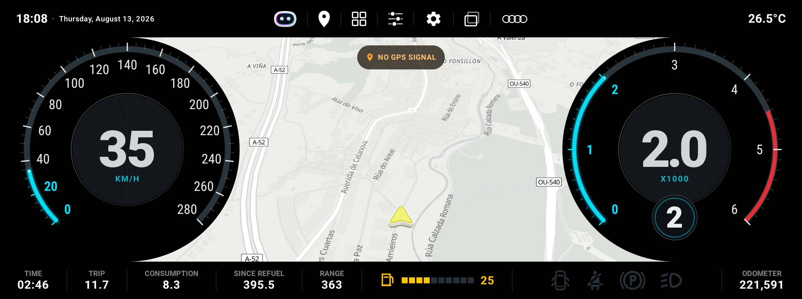
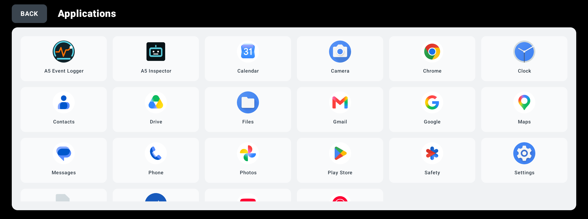
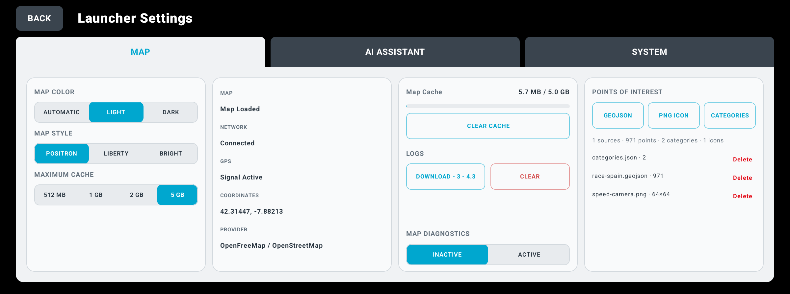
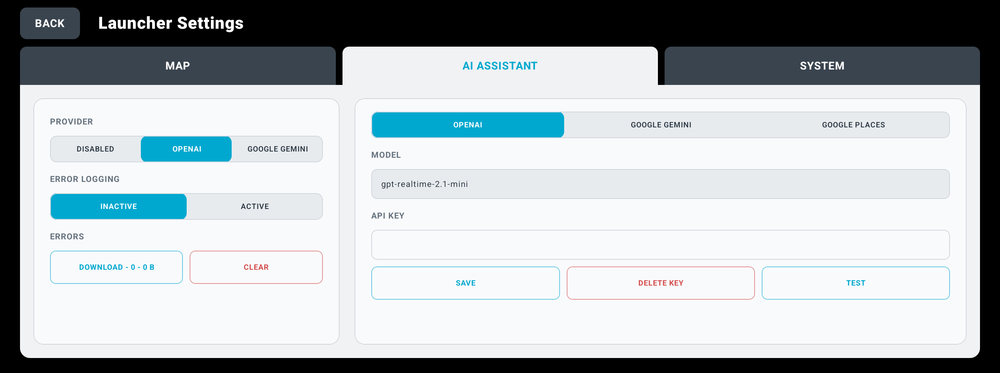
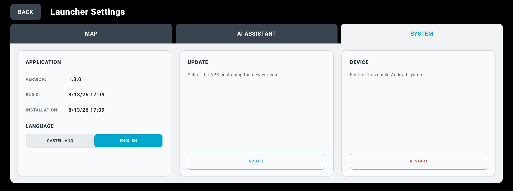

# A5 Launcher

A5 Launcher is an Android home-screen replacement designed for an ultra-wide
2400×896 head unit installed in an Audi A5. It combines an OEM-inspired
instrument cluster, vehicle telemetry, a MapLibre map, trip information and an
optional voice-driven AI assistant in one driving-oriented interface.

> This is an independent hobby project. It is not affiliated with or endorsed
> by Audi, Volkswagen Group, Waze, Google, OpenAI, ChoiceWay, Navifly or
> any other vehicle or software manufacturer.

[Leer en castellano](README.es.md)

## Highlights

- Speed, engine RPM, estimated gear and vehicle warning indicators.
- MapLibre vector map with local cache and importable GeoJSON points of interest.
- Current-trip duration, distance, estimated consumption and range.
- Reorderable dashboard actions and trip blocks.
- Optional OpenAI or Gemini voice assistant configured on the device.
- Application launcher and device/application settings shortcuts.
- Optimized ARM64 release build for the reference head unit.

The project is tailored to the documented reference device and its proprietary
ChoiceWay event interface. It is not a universal Android Auto application and
may require adaptation for a different vehicle, CAN box or firmware.

## Screenshots



| Applications | Map and POI settings |
|---|---|
|  |  |

| AI Assistant settings | System settings |
|---|---|
|  |  |

## Requirements

- JDK 17
- Android SDK Platform 37
- Android SDK Build Tools compatible with Android Gradle Plugin 9.3.1
- A 64-bit host for the Gradle toolchain

The Gradle wrapper is included, so a separate Gradle installation is not
required.

## Build

```bash
./gradlew testDebugUnitTest lintRelease assembleDebug
./scripts/compile.sh
```

`scripts/compile.sh` runs tests, release lint and the optimized release build. It writes
the installable APK, its SHA-256 checksum and the R8 mapping (when available)
to `out/`. The current release uses Android's standard debug signing key for
local sideloading and testing; do not treat it as a production distribution
signature.

To run the emulator with a local CAN/GPS replay:

```bash
python3 -m pip install -r requirements-emulator.txt
./scripts/emulator.sh --replay /path/to/can_bus_log.jsonl
```

The GPS replay uses the emulator control API so recorded position, speed and
bearing reach Android together and the map follows the real travel direction.

Files needed by Android's document picker can be copied to the emulator with:

```bash
./scripts/emulator.sh --replay /path/to/can_bus_log.jsonl --files /path/to/files
```

They will be available under `Downloads/A5-Cockpit` without being bundled in
the application or tracked by Git. While the script is running, subsequent
creations, replacements and deletions are synchronized automatically through
ADB. Both options can be used together.

Replay logs, APKs, captures, API keys and device dumps are deliberately ignored
by Git.

## Configuration and secrets

No API key is bundled. AI and Places keys are entered through the application
settings and stored locally. Never commit `.env`, a keystore, a device dump or
a diagnostic archive. See [SECURITY.md](SECURITY.md) before distributing a
build: long-lived provider keys inside a client application cannot be fully
protected from the device owner.

## Documentation

The documentation index is in [docs/INDEX.md](docs/INDEX.md). Device details,
architecture, telemetry research and feature notes live below `docs/`.

## Contributing

Contributions are welcome. Read [CONTRIBUTING.md](CONTRIBUTING.md), especially
the rules for translations, third-party assets and clean test fixtures.

## License and third-party material

Original project code is available under the [MIT License](LICENSE).
Dependencies, map data, trademarks and third-party visual assets remain under
their respective terms; see [THIRD_PARTY_NOTICES.md](THIRD_PARTY_NOTICES.md).
