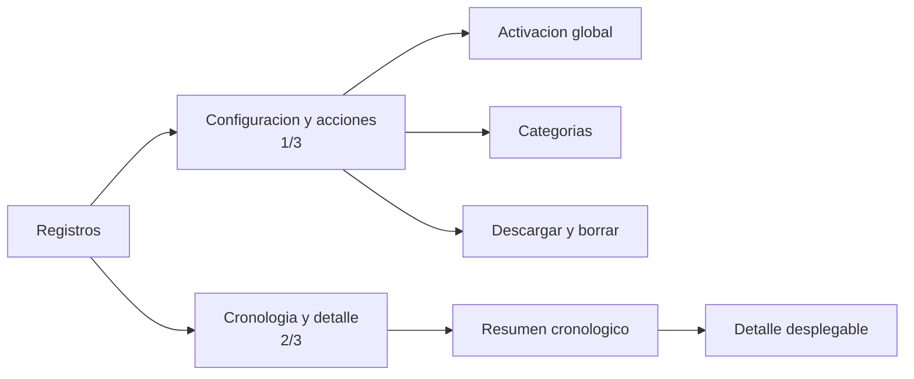
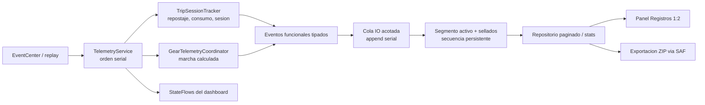
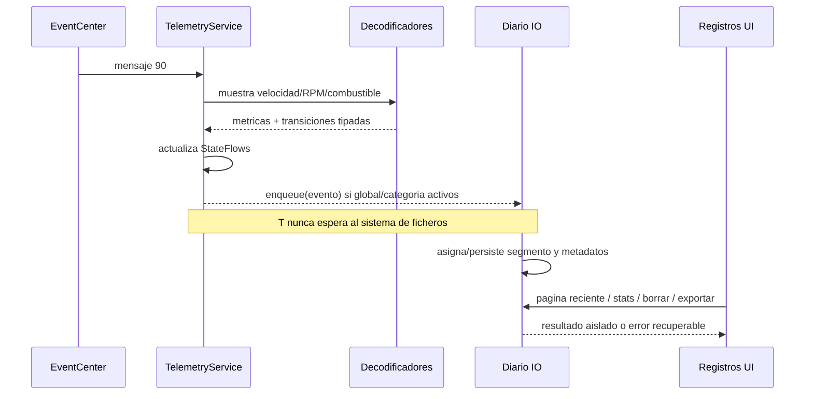
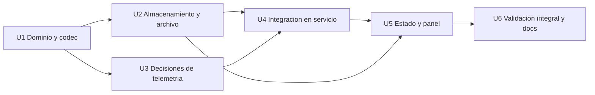

# Registros Funcionales - Plan

## Goal Capsule

- **Objective:** Incorporar un panel de registros funcionales que permita explicar decisiones relevantes del launcher sin capturar continuamente todos los datos CAN.
- **Product authority:** Las decisiones confirmadas en esta definición y el comportamiento funcional vigente del launcher.
- **Open blockers:** Ninguno.

---

## Product Contract

### Summary

Se añadirá una pestaña `Registros` antes de `Sistema` para configurar y consultar un diario persistente de eventos funcionales del vehículo.
El diario guardará únicamente transiciones y decisiones útiles para el diagnóstico, acompañadas por el contexto disponible en el momento del evento.

### Problem Frame

Algunos comportamientos del launcher, como reiniciar el parcial, restaurar una sesión o corregir una estimación, dependen de varias lecturas y reglas internas.
Cuando el resultado parece incorrecto, el estado final no explica qué observó el sistema ni por qué tomó esa decisión.
Los logs técnicos existentes son útiles para sus ámbitos concretos, pero no ofrecen una cronología legible de estas decisiones funcionales.

### Key Decisions

- **Diario funcional en lugar de captura CAN continua.** (session-settled: user-approved — chosen over broad raw-event capture: the useful diagnostic signal is in decisions and state transitions, not repeated samples.) Governs R6-R13.
- **Conservación indefinida y borrado manual.** (session-settled: user-directed — chosen over automatic expiry or storage limits: records must remain available until the owner decides to remove them.) Governs R18-R19.
- **Descarga conjunta.** (session-settled: user-directed — chosen over per-category export: one package is simpler to retrieve and preserves the complete diagnostic context.) Governs R20.
- **Desactivado inicialmente con las categorías preparadas.** (session-settled: user-approved — chosen over active-by-default or empty selection: collection remains opt-in without requiring setup after activation.) Governs R3-R5.
- **Resumen legible con detalle desplegable.** (session-settled: user-approved — chosen over summary-only or permanently expanded technical records: the chronology stays scannable while retaining evidence.) Governs R16-R17.
- **Catálogo limitado a cuatro categorías de alto valor.** (session-settled: user-directed — chosen over logging POI, connectivity, updates, and other low-value activity: indefinite retention must not become an indiscriminate event archive.) Governs R6-R10 and R23.

### Actors

- A1. **Propietario o conductor:** activa el registro, selecciona categorías, consulta eventos y administra los ficheros guardados.
- A2. **Launcher:** detecta decisiones funcionales, conserva su contexto y presenta una cronología explicable.
- A3. **Servicio de telemetría:** sigue recibiendo y procesando datos del vehículo aunque el panel de ajustes no esté visible.

### Requirements

**Panel and configuration**

- R1. La pestaña `Registros` aparecerá inmediatamente antes de `Sistema` en los ajustes del launcher.
- R2. El panel reservará aproximadamente un tercio del ancho para configuración y acciones, y dos tercios para la cronología de eventos.
- R3. En una instalación nueva, el registro global estará desactivado y las cuatro categorías estarán preseleccionadas.
- R4. La selección de categorías y el estado global se conservarán entre reinicios del launcher y del dispositivo.
- R5. Desactivar el registro global o una categoría impedirá únicamente nuevas capturas y nunca eliminará registros existentes.



**Event catalog**

- R6. `Repostaje y Parcial` registrará las detecciones aceptadas y rechazadas, el combustible observado antes y después, las condiciones de confirmación, el parcial anterior y el resultado aplicado.
- R7. `Sesión de Viaje` registrará si una sesión se restaura o se reinicia, qué métricas se recuperan y la razón por la que un estado previo se descarta.
- R8. `Consumo y Autonomía` registrará cambios del estado interno del modelo, calibraciones, correcciones y límites aplicados, sin convertir cada cálculo periódico en un evento.
- R9. `Estimación de Marcha` registrará los cambios de marcha calculados y las inconsistencias que la lógica reconozca, junto con velocidad, RPM y relación empleada, sin persistir el flujo continuo de muestras.
- R10. Cada categoría capturará transiciones o decisiones discretas; mantener estable un mismo estado no generará entradas repetidas.

**Event evidence**

- R11. Cada registro incluirá categoría, resumen, detalle técnico, instante de captura, sesión de arranque y una secuencia que preserve el orden real.
- R12. Cada registro incluirá sólo el contexto relevante disponible para explicarlo, como velocidad, RPM, combustible, distancias y valores anteriores y posteriores.
- R13. El panel no almacenará el recorrido CAN completo ni reconstruirá dentro del launcher las funciones del logger independiente.
- R14. Los eventos se capturarán mientras el procesamiento de telemetría esté activo, aunque el dashboard o los ajustes no estén en primer plano.
- R15. La corrección de la fecha del dispositivo después del arranque no alterará el orden de captura de los registros ya guardados.

**Reading and management**

- R16. La columna derecha mostrará una lista desplazable en orden cronológico inverso, con categoría, fecha y una frase de resumen por evento.
- R17. Un toque sobre un registro alternará la visualización de su detalle técnico y del contexto capturado.
- R18. Los registros se conservarán indefinidamente hasta que el usuario los borre manualmente.
- R19. El panel permitirá borrar todos los registros de una categoría o borrar el diario completo mediante una confirmación previa.
- R20. `Descargar Todo` solicitará siempre un destino y generará un único paquete con todos los registros; cancelar la selección o completar la descarga no eliminará los originales.
- R21. El panel mostrará el número de registros y el espacio ocupado para que el usuario pueda decidir cuándo descargar o limpiar.
- R22. Todos los textos visibles, categorías, resúmenes generados y mensajes de gestión estarán disponibles en castellano e inglés mediante los recursos de localización de la aplicación.

**Isolation and reliability**

- R23. Los logs de diagnóstico del mapa y los errores del Asistente IA conservarán sus sistemas y controles actuales, separados del diario funcional.
- R24. Un fallo al escribir, leer, descargar o borrar el diario no interrumpirá la telemetría, el dashboard ni las funciones de conducción.
- R25. Una entrada incompleta o dañada no impedirá consultar ni administrar los demás registros válidos.

### Key Flows

- F1. Activar la captura
  - **Trigger:** A1 abre `Registros` y activa el control global.
  - **Actors:** A1, A2.
  - **Steps:** A2 conserva las categorías preseleccionadas y comienza a guardar únicamente los eventos posteriores que pertenezcan a ellas.
  - **Outcome:** La captura queda activa sin modificar ni eliminar el historial existente.
  - **Covers:** R3-R5.
- F2. Registrar una decisión funcional
  - **Trigger:** A3 procesa una transición incluida en una categoría activa.
  - **Actors:** A2, A3.
  - **Steps:** A2 crea una entrada con resumen, detalle, orden estable y una instantánea limitada al contexto relevante.
  - **Outcome:** La decisión puede explicarse posteriormente sin conservar las muestras continuas que la originaron.
  - **Covers:** R6-R15, R24-R25.
- F3. Consultar el diario
  - **Trigger:** A1 abre la pestaña `Registros`.
  - **Actors:** A1, A2.
  - **Steps:** A2 presenta los eventos más recientes primero; A1 despliega sólo aquellos cuyo detalle necesita revisar.
  - **Outcome:** La cronología sigue siendo legible aunque conserve información técnica completa.
  - **Covers:** R16-R17, R21-R22.
- F4. Descargar o limpiar
  - **Trigger:** A1 elige descargar, borrar una categoría o borrar todo.
  - **Actors:** A1, A2.
  - **Steps:** La descarga solicita destino y mantiene los originales; el borrado solicita confirmación y afecta únicamente al alcance seleccionado.
  - **Outcome:** A1 controla de forma explícita la conservación del diario.
  - **Covers:** R18-R21, R24-R25.

### Acceptance Examples

- AE1. **Covers R3-R5.** Dada una instalación nueva, al abrir `Registros` las cuatro categorías aparecen seleccionadas y el control global desactivado; no se guarda nada hasta activarlo.
- AE2. **Covers R5, R10.** Dado un historial existente, al desactivar `Estimación de Marcha` dejan de añadirse cambios de marcha, pero sus entradas anteriores continúan visibles.
- AE3. **Covers R6, R11-R12.** Dado un posible repostaje que no supera la confirmación, se registra el rechazo y su contexto sin reiniciar el parcial.
- AE4. **Covers R6, R11-R12.** Dado un repostaje confirmado, el registro permite comparar combustible y parcial antes y después de aplicar el reinicio.
- AE5. **Covers R7, R14.** Dado un reinicio del launcher durante el mismo arranque del dispositivo, la restauración o descarte de la sesión queda registrado aunque los ajustes nunca se abran.
- AE6. **Covers R8-R10.** Dado un valor estable recibido repetidamente, no se generan entradas periódicas; sólo aparece una nueva entrada cuando cambia una decisión o estado relevante.
- AE7. **Covers R15-R17.** Dado que Android corrige su reloj después del arranque, los registros mantienen el orden en que ocurrieron y pueden desplegarse normalmente.
- AE8. **Covers R19.** Dado que existen registros de varias categorías, borrar `Consumo y Autonomía` elimina sólo esa categoría después de confirmar.
- AE9. **Covers R20.** Dado que A1 cancela el selector de destino, no se crea una descarga y el diario permanece intacto.
- AE10. **Covers R23-R25.** Dado un fallo del diario funcional, la telemetría continúa y los registros técnicos del mapa y del Asistente IA permanecen independientes.

### Scope Boundaries

- No se registrarán POI, pérdidas ordinarias de conexión, actualizaciones de APK, cambios normales de luces ni otras actividades de poco valor diagnóstico.
- No se incorporarán al panel las muestras CAN crudas o periódicas.
- No se sustituirá ni integrará la aplicación independiente de captura exhaustiva de eventos.
- No se fusionarán los logs del mapa ni los errores del Asistente IA con el nuevo diario.
- No habrá caducidad automática, rotación por tamaño ni borrado después de descargar.
- No se añadirá exportación individual por categoría.

### Dependencies and Assumptions

- El procesamiento actual de telemetría seguirá siendo la autoridad sobre repostaje, parcial, sesión, consumo, autonomía y entradas de velocidad/RPM.
- La estimación de marcha ya existe, pero la creación de eventos discretos y la identificación de inconsistencias forman parte de este trabajo.
- El volumen permanecerá acotado en la práctica porque R10 prohíbe convertir muestras estables o periódicas en registros.

### Sources and Research

- `app/src/main/java/com/lito/a5launcher/TelemetryService.kt` centraliza la recepción de telemetría, la restauración de sesión y su persistencia.
- `app/src/main/java/com/lito/a5launcher/TelemetryDecoder.kt` contiene las decisiones de repostaje, viaje, consumo, autonomía y estimación de marcha que deberán producir eventos funcionales.
- `app/src/main/java/com/lito/a5launcher/ui/components/MapDebugLogger.kt` y `app/src/main/java/com/lito/a5launcher/assistant/AssistantErrorLogger.kt` confirman que mapa y Asistente IA conservan sistemas de logs separados.
- `docs/feature-telemetry/TELEMETRY.md` documenta la captura exhaustiva en el proyecto independiente `a5-logger`.

---

## Planning Contract

Este contrato técnico implementa íntegramente el Product Contract anterior. No modifica sus categorías, política de conservación, alcance de exportación ni valores iniciales; únicamente fija cómo aislar, persistir y presentar esas decisiones sin degradar la telemetría.

### Key Technical Decisions

- **KTD1 — Eventos estructurados y localización al leer.** El diario conservará códigos estables de categoría y tipo, contexto numérico/booleano y metadatos de orden, no frases ya traducidas. La interfaz transformará esos códigos en resúmenes y etiquetas localizadas, por lo que un cambio posterior de idioma también afectará a eventos antiguos. Governs R11-R12, R16-R17, R22, R25.
- **KTD2 — JSONL segmentado en almacenamiento interno.** Se usará un directorio privado `filesDir/functional-event-journal` con segmentos JSONL por proceso del servicio y un esquema versionado. Cada línea será independiente para poder ignorar una última línea truncada o un evento incompatible sin perder el resto. No se añadirá Room ni una base de datos nueva. Governs R18, R21, R24-R25.
- **KTD3 — Orden global independiente del reloj civil y arranque O(1).** Cada evento recibirá una secuencia persistente y monotónica, además de `BOOT_COUNT`, tiempo transcurrido monotónico y fecha civil informativa. El escritor reservará bloques de secuencias en un high-water mark publicado atómicamente antes de utilizarlos; una caída puede dejar huecos, pero nunca reutilizar o reordenar valores. Los segmentos guardarán sus rangos para validar sólo los metadatos y el segmento reciente durante el arranque; si el high-water mark está dañado, la reconciliación completa se hará después en IO sin retrasar la restauración de telemetría. Lista y exportación usarán la secuencia como autoridad. Governs R11, R15, R24-R25.
- **KTD4 — Productores en `TelemetryService`, escritura en IO serial.** Las decisiones se formarán en la ruta serial actual de telemetría, pero sólo se encolarán hacia un escritor IO independiente. Configuración, append, lectura, exportación y borrado estarán encapsulados y los fallos nunca escaparán al callback Binder. Governs R4-R10, R14, R19-R20, R24.
- **KTD5 — Una sola autoridad de repostaje con referencia durable.** Un coordinador compartido producirá un resultado tipado para candidato confirmado o rechazado, con razón y evidencia. Al arrancar recibe la referencia de combustible persistente de `distance_since_refuel`, aunque haya cambiado `BOOT_COUNT`, y cada actualización confirmada vuelve a persistirla allí. `TripSessionTracker` consumirá la decisión para sus cálculos y `DistanceSinceRefuelTracker` la consumirá para reiniciar el parcial; ninguno mantendrá un segundo detector. Así los acumuladores del viaje pueden reiniciarse por boot sin perder la comparación necesaria para detectar un repostaje entre arranques. Un rechazo sólo existirá cuando un candidato real se invalide; el ruido ordinario no será un evento. Governs R6, R10-R12.
- **KTD6 — Marcha calculada en segundo plano sin perder el dato bruto.** `GearTelemetryCoordinator` pasará de `LauncherViewModel` a `TelemetryService`. El servicio conservará un `rawGearType` privado de tipo `Int` para EventCenter/replay y fallback, y expondrá por separado un `calculatedGearFlow` de tipo `String` para el dashboard. El coordinador emitirá sólo cambios confirmados, cambios inmediatos N/R y la entrada en una inconsistencia sostenida reconocida por la lógica. No se persistirán candidatos ni muestras estables. Governs R9-R10, R14.
- **KTD7 — Transiciones de consumo, no snapshots periódicos.** El modelo devolverá señales tipadas cuando cambie realmente una calibración, se corrija el combustible virtual, se actualice materialmente la referencia de autonomía o se entre/salga de un límite. `snapshot()` y el tick periódico seguirán libres de efectos de logging. Governs R8, R10-R12, R24.
- **KTD8 — Append continuo con snapshots sellados.** La UI solicitará páginas recientes en orden inverso en vez de cargar el historial indefinido completo y conservará una ventana máxima de 800 filas en memoria; el almacenamiento no se recorta. El append usará una cola IO acotada y dedicada. Al exportar o borrar, el control sellará y vaciará el segmento activo, abrirá inmediatamente otro para los eventos nuevos y entregará los segmentos sellados a una operación masiva exclusiva; así el ZIP o la reescritura no bloquearán la persistencia normal. Los metadatos de cada segmento incluyen rangos, recuentos y bytes para que abrir el panel no vuelva a parsear todo el histórico; un segmento sin metadatos tras una caída se reconstruye una sola vez. Si la cola alcanza su capacidad o falla el disco, se incrementará un contador observable y se conservará el último error en el panel, sin bloquear telemetría. Borrar una categoría afectará al snapshot confirmado y publicará los reemplazos mediante una transacción recuperable con estado preparado/confirmado y copias de respaldo; un reinicio a mitad de la operación revierte o completa la transacción sin dejar un borrado parcial. Governs R16-R21, R24-R25.
- **KTD9 — Panel aislado con estado y acciones estrechas.** El contenido de `Registros` vivirá en un componente propio con un modelo de estado y un objeto de acciones, usando los controles visuales, notificaciones flotantes, diálogos y selector SAF existentes. El estado distinguirá carga de página, fin de historial, error recuperable, exportación y borrado en curso para impedir operaciones incompatibles o duplicadas. Esto evita ampliar todavía más la firma y el tamaño de `DashboardScreen`. Governs R1-R5, R16-R22.

### High-Level Technical Design



La ruta de conducción sólo construye una estructura pequeña y no espera al disco. El append se ejecuta en un dispatcher IO dedicado y acotado; exportación y compactación trabajan sobre segmentos sellados mientras el escritor continúa con uno nuevo. El almacenamiento es privado y credential-protected: se inicializa cuando se crea `TelemetryService`, después del desbloqueo y antes de restaurar la sesión, nunca desde la pantalla de Direct Boot.



### Event Production Rules

- `Repostaje y Parcial`: candidato invalidado después de haber alcanzado el umbral, repostaje confirmado y reinicio aplicado. El evento confirmado incluye combustible base/observado, incremento, velocidad, muestras, parcial previo y parcial posterior. Un cambio de un litro, una lectura inválida o una muestra sin candidato no generan registro.
- `Sesión de Viaje`: una entrada al restaurar el servicio que distingue restauración del mismo arranque frente a descarte por nuevo arranque, esquema incompatible o estado temporal inválido. Incluye las métricas restauradas o descartadas. No se crea una entrada por cada persistencia de diez segundos.
- `Consumo y Autonomía`: actualización de factor de calibración, corrección material del combustible virtual, cambio material de la referencia aprendida y transición de entrada/salida del límite de consumo. Los umbrales de deduplicación serán constantes de dominio y tendrán pruebas de frontera.
- `Estimación de Marcha`: cambio calculado confirmado, N/R inmediata e inicio de inconsistencia sostenida. Una inconsistencia permanece como un único evento hasta recuperar una relación válida; muestras estables y candidatos de histéresis no se guardan.
- Los eventos producidos mediante replay se etiquetan `source=replay`; los reales, `source=eventcenter`. Ambos respetan la misma configuración y permiten validar la funcionalidad en el emulador.

### Persistence and Failure Semantics

- Cada evento contendrá `schema`, `sequence`, `bootSession`, `capturedAtEpochMs`, `capturedAtElapsedMs`, `source`, `category`, `type` y `context` estructurado.
- Cada proceso del servicio abre un segmento nuevo con nombre no dependiente del reloj civil. Una línea inválida se contabiliza como omitida y no impide leer las demás.
- La secuencia se toma de bloques reservados en un high-water mark publicado atómicamente antes de utilizarlos. En caso de caída se admiten huecos, nunca reordenación ni reutilización; una recuperación costosa nunca bloquea el arranque del servicio.
- `Descargar Todo` sella el segmento activo, continúa el append en otro y crea un ZIP con el snapshot de segmentos sellados y un manifiesto de esquema, rangos, recuentos, bytes y líneas omitidas; los originales permanecen intactos.
- El borrado por categoría sella el segmento activo, conserva líneas válidas de otras categorías y líneas dañadas no clasificables, prepara todos los reemplazos con `fsync` y los publica bajo un manifiesto transaccional recuperable antes de refrescar stats/páginas. Los eventos añadidos después del snapshot no forman parte de ese borrado.
- El contador representa entradas válidas; el tamaño representa bytes físicos. Si se omiten líneas dañadas, el panel lo indica como estado operativo sin intentar registrar ese fallo dentro del propio diario.
- Ninguna operación tiene caducidad o rotación automática. La desinstalación sigue eliminando los datos privados de la aplicación; no se amplía el backup de Android.

### Assumptions

- El diario comienza vacío en esta versión y no necesita migrar ficheros de logs anteriores.
- Las cuatro categorías siguen seleccionadas aunque el interruptor global esté apagado; cambiar una preferencia afecta al siguiente evento y no reinterpreta el historial.
- La lista puede crecer durante años; segmentación, paginación y stats fuera del hilo principal son requisitos de diseño, no optimizaciones opcionales.
- Los textos almacenados no son contractuales. Los códigos y campos estructurados sí deben mantener compatibilidad de lectura dentro del esquema soportado.
- No existen aprendizajes institucionales adicionales en `docs/solutions`; los precedentes relevantes son los loggers locales y el repositorio POI del código actual.

### Risks and Mitigations

- **Duplicación o divergencia del repostaje:** hoy existen dos detectores con estados restaurados distintos. Se elimina la doble autoridad mediante un resultado único y pruebas que comparan parcial, viaje y evento emitido.
- **Bloqueo de telemetría por IO:** queda prohibido escribir, listar o comprimir desde el dispatcher del callback. Una prueba con un sink que falla y validación de replay demostrarán que las métricas continúan.
- **Backpressure o almacenamiento lleno:** la cola acotada evita crecimiento de memoria. Saturación y fallos incrementan métricas operativas visibles en el panel y descartan sólo la entrada que no pudo encolarse, sin recursión de logging ni bloqueo del servicio.
- **Historial indefinido:** un `LazyColumn` no basta si se materializa todo antes. El repositorio limita cada página, mantiene stats fuera del hilo UI y no lee el archivo completo por recomposición.
- **Fecha incorrecta al arrancar:** nombres y orden no dependen de epoch. Se conserva la fecha observada sólo como dato y se muestra la cronología por secuencia.
- **Idioma posterior a la captura:** almacenar resúmenes renderizados congelaría el idioma. Se guardan códigos/contexto y se renderiza en el locale actual.
- **Carreras entre append, export y borrado:** el sellado/apertura de segmento comparte una frontera serial breve; las operaciones masivas son mutuamente excluyentes sobre snapshots sellados y los reemplazos son atómicos.
- **Regresión al mover autoridades:** antes del corte se fijan pruebas de caracterización sobre replays y estados persistidos. El resultado calculado del dashboard, las métricas del viaje y el parcial deben ser equivalentes salvo los casos explícitos que corrige la autoridad durable de repostaje.
- **Ruido de marcha o consumo:** las pruebas alimentan muestras repetidas, candidatos, recuperación y fronteras para demostrar que sólo se registran transiciones terminales.
- **Replay confundido con conducción real:** el contexto incluye la fuente para interpretar los resultados de emulador sin excluirlos de las pruebas.

### Sequencing



---

## Implementation Units

### U1. Modelo de eventos, configuración y codec

- **Goal:** Definir el contrato estable que separa decisiones funcionales, persistencia y texto localizado.
- **Requirements:** R3-R5, R10-R13, R15, R22, R25.
- **Dependencies:** Ninguna.
- **Files:**
  - New: `app/src/main/java/com/lito/a5launcher/functional/FunctionalEvent.kt`
  - New: `app/src/main/java/com/lito/a5launcher/functional/FunctionalEventSettings.kt`
  - New: `app/src/main/java/com/lito/a5launcher/functional/FunctionalEventCodec.kt`
  - New tests under `app/src/test/java/com/lito/a5launcher/functional/`
- **Approach:** Crear enums/códigos estables para las cuatro categorías, tipos de evento y fuente; un contexto tipado serializable a JSON; preferencias con global `false` y categorías `true`; codec versionado que rechace sólo la línea incompatible y conserve valores desconocidos como detalle técnico seguro.
- **Test Scenarios:** defaults de instalación nueva; persistencia independiente de global/categorías; round-trip de todos los tipos; epoch decreciente con secuencia creciente; línea truncada, JSON inválido, esquema desconocido y campos extra.
- **Verification:** Tests JVM focalizados del paquete `functional` y paridad de recursos preparada para U5.

### U2. Diario persistente, paginación, borrado y exportación

- **Goal:** Proporcionar almacenamiento indefinido y administrable sin bloquear productores ni cargar todo el historial en memoria.
- **Requirements:** R11, R15-R21, R24-R25.
- **Dependencies:** U1.
- **Files:**
  - New: `app/src/main/java/com/lito/a5launcher/functional/FunctionalEventJournal.kt`
  - New: `app/src/main/java/com/lito/a5launcher/functional/FunctionalEventArchive.kt`
  - New: `app/src/test/java/com/lito/a5launcher/functional/FunctionalEventJournalTest.kt`
  - New: `app/src/test/java/com/lito/a5launcher/functional/FunctionalEventArchiveTest.kt`
- **Approach:** Un escritor IO acotado procesa append y reserva secuencias en bloques mediante high-water mark atómico. Los segmentos JSONL son append-only durante su proceso; el control los sella rápidamente para abrir uno nuevo antes de exportar o borrar. Una exclusión mutua distinta serializa sólo las operaciones masivas sobre snapshots sellados. La carga reciente recorre segmentos desde el final hasta completar la página y ordena por secuencia. Exportar escribe ZIP + manifiesto al `Uri` SAF sin detener el segmento nuevo.
- **Test Scenarios:** append/reinicio/recuperación O(1) de secuencia y huecos tras caída; high-water mark corrupto con reconciliación posterior; múltiples segmentos; paginación sin duplicados; fecha corregida; línea dañada; stats; cola llena/disco lleno y contador de pérdida; borrar una categoría y todo; exportar conserva originales; fallo/cancelación de destino; append continúa durante export/delete y el snapshot tiene una frontera determinista.
- **Verification:** Tests JVM con directorios temporales para el núcleo de ficheros y un adaptador de salida inyectable para probar el ZIP sin instrumentación Android.

### U3. Decisiones discretas de repostaje, consumo y marcha

- **Goal:** Hacer explícitas y testeables las transiciones de dominio que alimentan el diario, sin añadir efectos de IO a los cálculos.
- **Requirements:** R6-R10, R12-R14.
- **Dependencies:** U1.
- **Files:**
  - Modify: `app/src/main/java/com/lito/a5launcher/TelemetryDecoder.kt`
  - Modify: `app/src/test/java/com/lito/a5launcher/TelemetryDecoderTest.kt`
- **Approach:** Antes de cambiar ownership, añadir pruebas de caracterización con los replays y estados restaurados actuales para fijar marcha visible, métricas y parcial. Después, enriquecer `ConfirmedRefuelDetector` con resultados terminales y razones; crear un solo coordinador inicializado desde la referencia durable del parcial y pasar la misma decisión al viaje y al acumulador parcial; devolver transiciones junto a las métricas del viaje; hacer que calibración/rango/clamp expongan cambios deduplicados; enriquecer el coordinador de marcha con cambio e inconsistencia sin alterar el valor visual vigente.
- **Test Scenarios:** candidato de repostaje aceptado y rechazado por cada razón útil; ausencia de evento para ruido; único reset/evento compartido; contexto antes/después; baseline y parcial persistidos seguidos de nuevo boot y repostaje +3 L confirmado en dos muestras; calibración y corrección sólo una vez; entrada/salida del cap sin repetición; cambios de marcha tras histéresis, N/R inmediata, inconsistencia sostenida y recuperación.
- **Verification:** Suite completa `TelemetryDecoderTest`; las pruebas de caracterización se escriben antes del refactor y deben seguir verdes después, excepto nuevos casos explícitos de baseline durable entre boots y evidencia de rechazo.

### U4. Integración de productores y diario en `TelemetryService`

- **Goal:** Capturar los cuatro tipos mientras la telemetría esté activa y mantener al dashboard independiente del ciclo de vida de captura.
- **Requirements:** R4-R15, R23-R25.
- **Dependencies:** U1-U3.
- **Files:**
  - Modify: `app/src/main/java/com/lito/a5launcher/TelemetryService.kt`
  - Modify: `app/src/main/java/com/lito/a5launcher/LauncherViewModel.kt`
  - Modify: `app/src/test/java/com/lito/a5launcher/TelemetryServiceSchemaTest.kt`
  - Add service/publisher tests where the extracted pure restoration decision lives.
- **Approach:** Inicializar settings/journal antes de restaurar sesión; emitir el resultado tipado de restauración; mover `GearTelemetryCoordinator` al servicio, mantener `rawGearType` privado y exponer `calculatedGearFlow`; traducir transiciones de dominio a `FunctionalEvent`; consultar global/categoría al crear cada evento; encolar con `runCatching` sin tocar mapa/IA. ViewModel deja de estimar y sólo refleja el flujo calculado del servicio.
- **Test Scenarios:** restauración mismo boot, reinicio por nuevo boot/esquema/estado inválido; baseline de repostaje sobrevive a nuevo boot; dashboard recibe la misma marcha calculada y N/R conserva el fallback bruto; servicio captura con UI no enlazada; categorías/global bloquean sólo eventos nuevos; sink que falla no bloquea métricas; replay queda etiquetado.
- **Verification:** Tests focalizados de esquema/publicador y replay de telemetría en emulador con otra app en primer plano.

### U5. Estado de UI, pestaña Registros y localización

- **Goal:** Permitir configurar, leer, expandir, descargar y limpiar el diario con el layout 1:2 acordado.
- **Requirements:** R1-R5, R16-R22, R24-R25.
- **Dependencies:** U2, U4.
- **Files:**
  - New: `app/src/main/java/com/lito/a5launcher/ui/components/FunctionalLogsPanel.kt`
  - Modify: `app/src/main/java/com/lito/a5launcher/ui/components/DashboardScreen.kt`
  - Modify: `app/src/main/res/values/strings.xml`
  - Modify: `app/src/main/res/values-es/strings.xml`
  - Modify: `app/src/test/java/com/lito/a5launcher/LocalizationResourcesTest.kt`
  - New: `app/src/test/java/com/lito/a5launcher/functional/FunctionalEventPresentationTest.kt`
- **Approach:** Añadir el tab antes de Sistema; conectar un único `FunctionalLogsUiState` y acciones; izquierda con global, checkboxes, count/size y dos acciones principales: `Descargar Todo` y `Borrar`. `Borrar` abre un selector de alcance con las cuatro categorías y `Todo`, y después una confirmación que nombra el alcance, separado visualmente de los checkboxes de captura. La derecha usa `LazyColumn` paginada, claves por secuencia, una ventana acotada de 800 filas y fila completa expandible. Al aproximarse al final carga automáticamente la página siguiente; integra estados de carga, fin y reintento sin perder las filas que sigan dentro de la ventana. Exportación y borrado muestran estado en curso, desactivan acciones incompatibles y terminan mediante `FloatingNotificationHost`. Renderizar códigos y campos con recursos en el locale actual y aportar semántica de seleccionado/expandido sin depender sólo del color.
- **Test Scenarios:** orden del tab; controles editables con global apagado; páginas/expansión estables; carga automática, fin y reintento; vacío/corrupción recuperable; acciones incompatibles desactivadas durante export/borrado; cancelar exportación; elegir alcance y confirmar/cancelar borrados; textos ES/EN, decimales y fechas locales; tamaño formateado; fila completa pulsable y estado expandido semántico.
- **Verification:** Tests de presentación/recursos y validación visual 2400×896 en castellano e inglés con historial corto, largo y detalles expandidos.

### U6. Integración, documentación y endurecimiento final

- **Goal:** Probar el sistema completo, documentar su alcance y dejar una entrega publicable sin artefactos de intentos descartados.
- **Requirements:** R1-R25; AE1-AE10.
- **Dependencies:** U1-U5.
- **Files:**
  - Modify: `docs/feature-telemetry/TELEMETRY.md`
  - Modify: `docs/INDEX.md` si su índice requiere una entrada nueva.
  - Existing build and local validation scripts only as execution targets.
- **Approach:** Documentar diferencia entre diario funcional, logs del mapa/IA y `a5-logger`; ejecutar fixtures/replay para producir ejemplos de las cuatro categorías; validar conservación entre procesos/boots, exportación y borrado; revisar que no quedan muestras periódicas ni IO en el callback.
- **Test Scenarios:** todos los Acceptance Examples; segundo plano; corrección del reloj; historial corrupto; alta cantidad de eventos paginada; export durante captura; borrado selectivo; reinicio de servicio; app en ambos idiomas.
- **Verification:** Gates completos de Gradle, scripts públicos, compilación release mediante el flujo local y revisión del APK generado.

---

## Verification Contract

### Automated gates

1. Durante U1-U5, ejecutar primero tests focalizados en rojo/verde y después:

   ```bash
   ./gradlew --no-daemon testDebugUnitTest
   ```

2. Antes de revisión final:

   ```bash
   ./gradlew --no-daemon testDebugUnitTest lintRelease assembleDebug assembleRelease
   ./scripts/check-public-repo.sh
   git diff --check
   ```

3. Para la entrega de producción, usar el wrapper local acordado, que ejecuta el gate release público y copia el APK sólo en el entorno privado:

   ```bash
   ./local/compile.sh
   ```

### Required behavioral verification

- Replay en emulador del fichero local configurado, con registro global activo: comprobar cambios de marcha y al menos transiciones de consumo/sesión sin entradas repetidas por muestra.
- Mantener una exportación y un borrado selectivo sobre un historial grande mientras continúa el replay; comprobar que el append sigue avanzando, la cola no crece sin límite y el snapshot excluye de forma determinista eventos posteriores al sellado.
- Forzar una secuencia de candidato rechazado y una confirmación de repostaje mediante test/fixture determinista; verificar parcial previo/posterior y un solo evento.
- Abrir otra aplicación mientras `TelemetryService` sigue activo y confirmar que se siguen añadiendo eventos.
- Cambiar el reloj civil hacia delante y atrás entre eventos; la UI conserva el orden por secuencia.
- Introducir una última línea JSONL truncada; el resto se lista, exporta y borra normalmente.
- Validar 2400×896 en castellano e inglés: layout 1:2, lista con scroll, expansión, confirmaciones, notificaciones y tabs sin desbordes.
- Durante paginación, exportación y borrado, validar progreso visible, prevención de doble acción y conservación de filas/expansiones ya mostradas ante error recuperable.
- Cancelar el selector de descarga; no se crea salida ni se borran datos. Completarlo; el ZIP contiene manifiesto/segmentos y los originales siguen visibles.
- Borrar una categoría y comprobar que las otras permanecen; borrar todo y comprobar que global/categorías conservan sus preferencias.

### Review gates

- `ce-simplify-code` sobre el diff asentado, preservando comportamiento.
- `ce-code-review` con atención especial a callback/IO, carreras append-export-delete, corrupción, retención indefinida, Direct Boot y regresiones del cálculo de marcha/repostaje.
- No se acepta la entrega con P0/P1 sin resolver ni con un test que sólo pruebe helpers aislados sin cubrir la integración que nombra.

---

## Definition of Done

- [ ] El plan conserva el Product Contract y todos R1-R25/AE1-AE10 tienen implementación y evidencia verificable.
- [ ] La pestaña `Registros` aparece antes de `Sistema`, respeta el layout 1:2 y funciona completa en castellano e inglés.
- [ ] El estado inicial es global apagado + cuatro categorías seleccionadas, y las preferencias sobreviven a reinicios sin borrar historial.
- [ ] Los cuatro productores generan sólo eventos discretos útiles mientras el servicio está activo, incluso sin dashboard en primer plano.
- [ ] Repostaje/parcial se decide una sola vez y los rechazos terminales incluyen razón y evidencia; marcha ya no depende del ViewModel.
- [ ] El diario mantiene orden por secuencia aunque cambie la fecha, sobrevive a líneas dañadas y nunca ejecuta IO en el callback de telemetría.
- [ ] El historial se pagina, muestra count/bytes, se expande, exporta junto y se borra por categoría o completo con las confirmaciones acordadas.
- [ ] Logs de mapa, errores del Asistente IA y `a5-logger` permanecen separados y sin cambios de alcance.
- [ ] Tests focalizados y gates completos pasan; el replay/emulador y la validación visual 2400×896 quedan documentados.
- [ ] `./local/compile.sh` termina correctamente y produce el APK release esperado.
- [ ] La documentación técnica está actualizada y no quedan ramas muertas, archivos temporales, código experimental ni dependencias nuevas innecesarias.
- [ ] El cambio está revisado, comprometido, publicado y la CI remota finaliza en verde.
